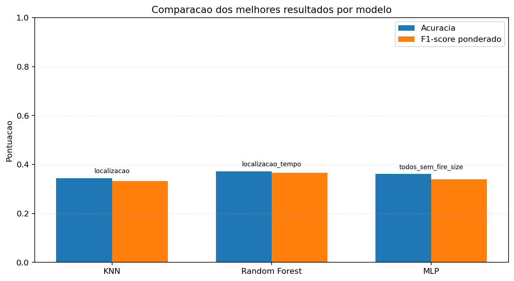
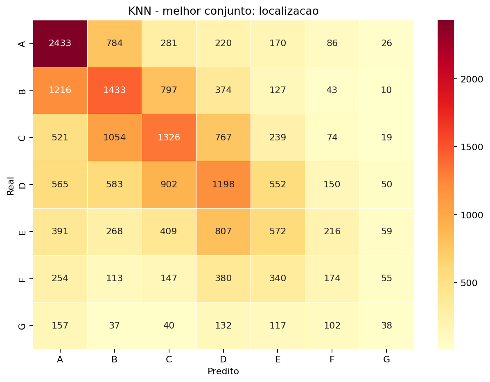
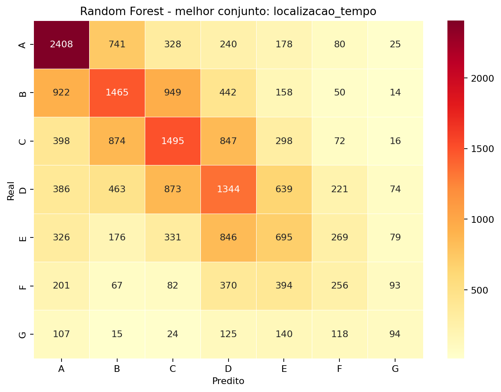
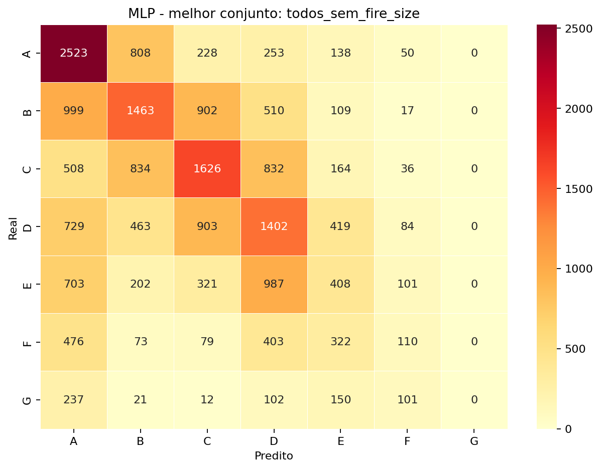

Disciplina de Inteligência Artificial , Professor Munif , Unicesumar 2026

# Análise de Incêndios Florestais nos EUA com Machine Learning

## Integrantes

- Paulo Henrique Basso Bessa - RA: 26005799-2

## Resumo do projeto

Este projeto utiliza dados históricos de incêndios florestais no território continental dos Estados Unidos para investigar se é possível prever a classe de tamanho final de um incêndio a partir de informações conhecidas no registro da ocorrência, como localização, ano, dia do ano, estado e causa reportada.

O problema foi tratado como uma tarefa de classificação multiclasse. A variável alvo é `FIRE_SIZE_CLASS`, que classifica os incêndios de `A` até `G`, sendo `A` a menor classe e `G` a maior. Foram comparados três modelos de Inteligência Artificial: KNN, Random Forest e MLP.

Hipótese da equipe: atributos relacionados à localização e ao contexto da ocorrência, principalmente latitude, longitude, estado, data e causa, contêm padrões suficientes para melhorar a previsão da classe de tamanho em relação a um palpite baseado apenas na classe majoritária da amostra usada no experimento.

## Dataset

O dataset utilizado foi o **1.88 Million US Wildfires**, disponibilizado no Kaggle:

https://www.kaggle.com/datasets/rtatman/188-million-us-wildfires/data

A base original reúne registros de incêndios florestais nos Estados Unidos entre 1992 e 2015. No arquivo SQLite usado neste projeto, a tabela `Fires` contém **1.880.465 registros**.

Distribuição das classes no dataset completo:

| Classe | Registros | Percentual |
|---|---:|---:|
| A | 666.919 | 35,47% |
| B | 939.376 | 49,95% |
| C | 220.077 | 11,70% |
| D | 28.427 | 1,51% |
| E | 14.107 | 0,75% |
| F | 7.786 | 0,41% |
| G | 3.773 | 0,20% |

Como a classe `B` representa quase metade da base completa, a modelagem usa uma amostra mais balanceada por classe. O recorte do experimento considera apenas os EUA continentais, com latitude entre `24` e `50` e longitude entre `-125` e `-66`. Esse recorte exclui Alaska, Hawaii e Porto Rico por decisão metodológica.

Distribuição da amostra usada na modelagem:

| Classe | Registros na amostra |
|---|---:|
| A | 10.000 |
| B | 10.000 |
| C | 10.000 |
| D | 10.000 |
| E | 10.000 |
| F | 7.316 |
| G | 3.114 |
| **Total** | **60.430** |

A divisão treino/teste foi estratificada em 80% para treino e 20% para teste. O conjunto de treino ficou com 48.344 registros e o conjunto de teste com 12.086 registros.


## Preparação dos dados

O notebook lê o arquivo `wildfires_dataset.sqlite` e seleciona as seguintes colunas:

- `FIRE_YEAR`
- `DISCOVERY_DOY`
- `STAT_CAUSE_DESCR`
- `FIRE_SIZE`
- `FIRE_SIZE_CLASS`
- `LATITUDE`
- `LONGITUDE`
- `STATE`

A coluna `FIRE_SIZE` é carregada apenas para referência, mas não é usada como entrada dos modelos, porque `FIRE_SIZE_CLASS` deriva do tamanho final do incêndio. Usar `FIRE_SIZE` como feature causaria vazamento direto da resposta.

Tratamentos realizados:

- remoção de registros com valores nulos nas colunas usadas;
- filtro geográfico para manter apenas registros dos EUA continentais;
- filtro das classes válidas de `A` a `G`;
- amostragem de até 10.000 registros por classe, usando o máximo disponível quando a classe possui menos registros;
- divisão estratificada 80/20 entre treino e teste;
- padronização das variáveis numéricas com `StandardScaler`;
- codificação das variáveis categóricas com `OneHotEncoder`.

## Modelos utilizados

Foram testados diferentes conjuntos de features para cada modelo.

| Modelo | Parte da disciplina | Descrição |
|---|---|---|
| KNN | Parte 1 | Classificador baseado nos vizinhos mais próximos. |
| Random Forest | Parte 2 | Conjunto de árvores de decisão treinadas com aleatoriedade. |
| MLP | Parte 2 | Rede neural multicamadas com `early_stopping`. |

Conjuntos de features avaliados:

- `localizacao`
- `localizacao_estado_ano_diaAno`
- `localizacao_estado_causa`
- `tempo`
- `causa`
- `estado`
- `localizacao_tempo`
- `localizacao_causa`
- `localizacao_estado`
- `causa_estado`
- `todos_sem_fire_size`

## Avaliação dos modelos

As métricas usadas foram:

- acurácia;
- F1-score ponderado;
- matriz de confusão;
- tempo de treinamento e avaliação.

Resultados da execução atual do notebook:

| Modelo | Melhor conjunto de features | Acurácia | F1-score ponderado | Tempo |
|---|---|---:|---:|---:|
| KNN | `localizacao_causa` | 31,49% | 0,3061 | 5,50s |
| Random Forest | `localizacao_estado_ano_diaAno` | 34,13% | 0,3374 | 4,20s |
| MLP | `todos_sem_fire_size` | 33,23% | 0,3157 | 2,09s |



### Matrizes de confusão dos melhores modelos

KNN:



Random Forest:



MLP:



## Comparação dos resultados

O Random Forest obteve o melhor desempenho geral da execução, com **34,13%** de acurácia e **0,3374** de F1-score ponderado. O MLP ficou próximo em acurácia, com **33,23%**, mas apresentou F1-score ponderado menor, de **0,3157**.

Com a amostra balanceada, a classe majoritária da amostra representa aproximadamente **16,55%** dos registros. Todos os modelos superaram esse baseline simples, indicando que as features escolhidas carregam informação útil para a classificação. Ao mesmo tempo, as métricas ficaram menores do que na base desbalanceada, porque o experimento deixou de favorecer o acerto nas classes `A` e `B`.

## Conclusão

Os resultados mostram que é possível prever a classe de tamanho de incêndios florestais com desempenho superior a um baseline simples baseado na classe majoritária da amostra. O melhor resultado geral foi obtido pelo Random Forest usando localização, estado, ano e dia do ano.

Para este problema, os modelos da Parte 2 continuaram superando o KNN, mas a amostragem por classe deixou a tarefa mais difícil e mais honesta. O resultado sugere que localização e tempo são fatores relevantes, mas ainda não suficientes para uma previsão altamente precisa da classe final de tamanho.

## Como executar

1. Crie e ative o ambiente virtual:

```shell
python -m venv .venv
source .venv/bin/activate
```

No Windows PowerShell:

```powershell
py -m venv .venv
.venv/Scripts/Activate.ps1
```

2. Instale as dependências:

```shell
pip install -r requirements.txt
```

3. Baixe o dataset no Kaggle:

https://www.kaggle.com/datasets/rtatman/188-million-us-wildfires/data

4. Coloque o arquivo SQLite na raiz do projeto com o nome:

```text
wildfires_dataset.sqlite
```

5. Execute o notebook:

```shell
jupyter notebook main.ipynb
```

Também é possível reexecutar pelo terminal:

```shell
jupyter nbconvert --to notebook --execute --inplace main.ipynb --ExecutePreprocessor.timeout=-1
```

## Modelo treinado

O projeto não armazena um arquivo de modelo treinado separado. Os modelos são treinados diretamente no notebook `main.ipynb` a partir do dataset. Para reproduzir os resultados, basta baixar o arquivo SQLite, colocá-lo na raiz do projeto e executar todas as células do notebook.

## Referências

Dataset no Kaggle:

https://www.kaggle.com/datasets/rtatman/188-million-us-wildfires/data

Citação oficial solicitada pelo criador da base:

Short, Karen C. 2017. Spatial wildfire occurrence data for the United States, 1992-2015 [FPA_FOD_20170508]. 4th Edition. Fort Collins, CO: Forest Service Research Data Archive. https://doi.org/10.2737/RDS-2013-0009.4

Reconhecimento de uso:

These data were collected using funding from the U.S. Government and can be used without additional permissions or fees.
